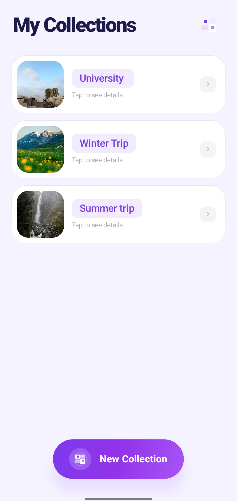
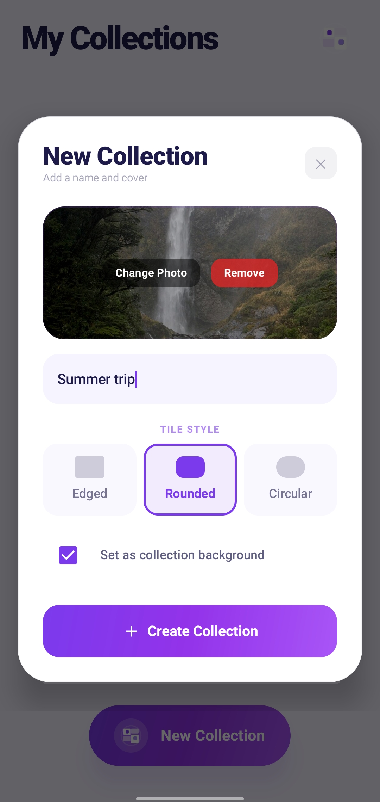
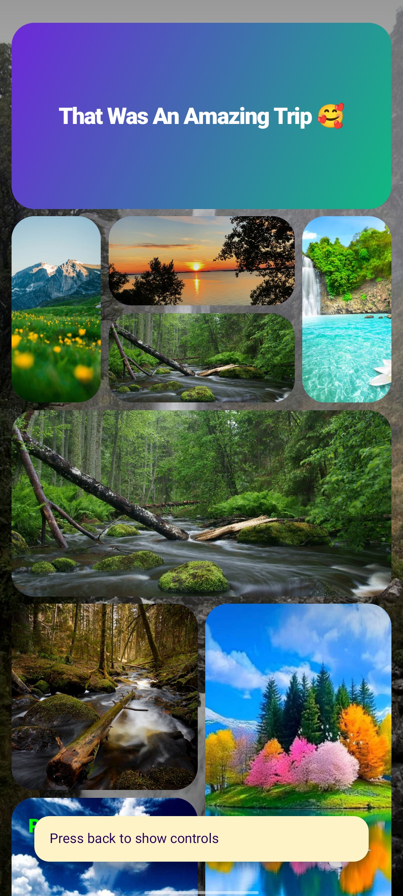
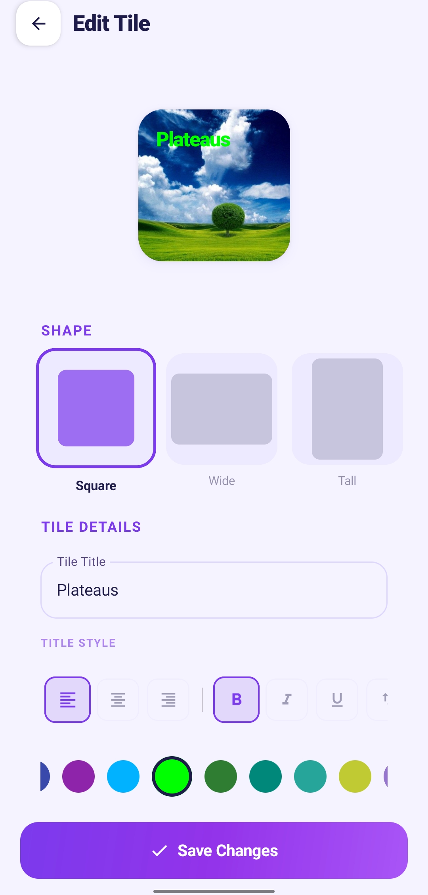
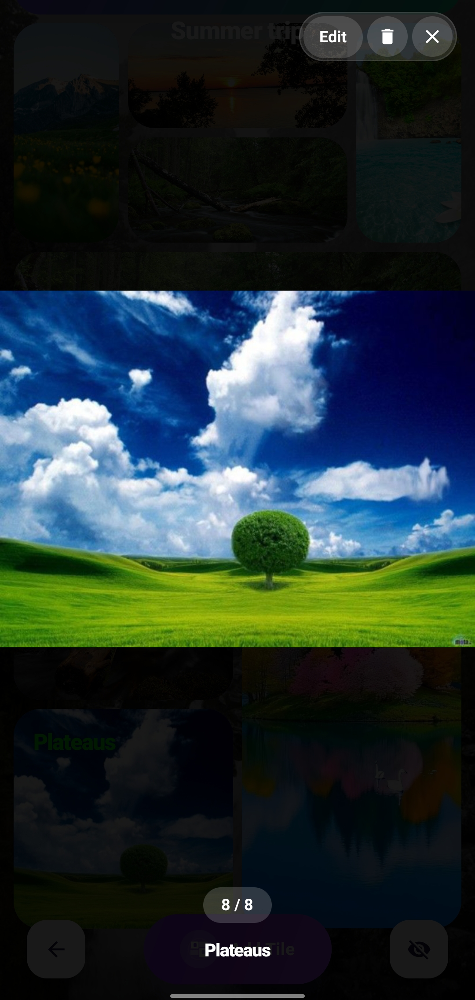

# 📌 Bento Grid
> Create visually stunning, dynamic, and fully customizable grid-based collections.

## 📖 Overview
Bento Grid App is a modern Android application that empowers users to curate stunning visual collections using a flexible, dynamic Bento-style grid system. By allowing the creation of named collections, the app offers a highly aesthetic and customizable way to organize images, notes, and memories into beautifully balanced layouts.

---

## ✨ Features

**Grid System Features**
* **Dynamic Bento Layout**: Intelligent grid system that auto-aligns items to maintain a visually balanced aesthetic.
* **Auto-Fill Mechanism**: Automatically detects empty spaces and optimally fills them based on available tile dimensions.
* **Multiple Shape Variations**: Choose from Rectangular (Square, Tall, Wide, Small) and stylized clipping shapes (Edged, Rounded, Circular/Capsule).

**Collection Management**
* **Custom Collections**: Create, edit, and organize multiple themed collections from a central dashboard.
* **Cover Images & Backgrounds**: Set stunning cover photos for collections and optionally use them as immersive full-screen backgrounds.

**Image Handling**
* **Local Storage Optimization**: Secure, compressed local storage handling for uploaded images to save device space.
* **Advanced Image Viewer**: Full-screen overlay image viewer with pinch-to-zoom, swipe-to-dismiss physics, and gesture support.

**UI/UX Features**
* **Rich Customization**: Customize tile colors (solid vibrant, monochrome, premium gradients), text styling, typography, and content alignment.
* **Immersive Experience**: Edge-to-edge design with dynamic status bar handling and rich haptic feedback.
* **Smooth Animations**: High-quality Jetpack Compose animations for seamless screen transitions, dialog scales, and grid interactions.

**Data Storage**
* **Persistent Storage**: Robust, localized data management using Room Database.
* **Efficient Caching**: Local caching of compressed images for fast, responsive load times.

---

## 🧩 Bento Grid System
The heart of Bento Grid is its advanced first-fit packing algorithm that dynamically arranges tiles to eliminate wasted space while maintaining the iconic "Bento Box" visual flow.

* **Grid Dimensions**: The grid relies on a precise 4-column system.
* **Tile Shapes**: Tiles can be configured with varying footprints:
  * **Square (2x2)**: The standard proportional tile.
  * **Wide (4x1 / 4x2)**: Spans the full width of the screen.
  * **Tall (2x4)**: Portrait-style tile for vertical imagery.
  * **Small (1x2 / 2x1)**: For compact details and half-width inserts.
* **Styling & Clipping**: Beyond dimensions, tiles can be visually clipped as **Edged** (sharp corners), **Rounded** (smooth corners), or **Circular/Capsule**.
* **Intelligent Auto-Alignment**: As tiles are added to a collection, the layout algorithm scans the grid from top-left to bottom-right, identifying the first available slot that fits the tile's exact dimensions without overlapping. This ensures a tightly packed and aesthetically cohesive layout regardless of insertion order.

---

## 🖼 Image Handling System
Bento Grid provides a seamless and safe approach to media management:
* **Upload & Optimization**: Images picked from the device gallery are automatically downscaled and compressed (optimized to an 800px width) before being saved securely to the app's internal storage, preventing app bloat.
* **Storage Safety**: When tiles or collections are updated or deleted, the associated physical image files are safely tracked and removed from storage to free up space without leaving orphan files.
* **Interactive Viewer**: Tapping an image tile opens a full-screen, immersive Lightbox overlay. Built with Coil and ZoomImage, it supports high-performance pinch-to-zoom, double-tap gestures, and physical swipe-to-dismiss animations while smoothly handling edge-to-edge window insets.

---

## 🛠 Tech Stack
* **Language**: Kotlin
* **UI Toolkit**: Jetpack Compose (Material Design 3)
* **Architecture**: MVVM (Model-View-ViewModel)
* **Local Database**: Room Database
* **Asynchronous Programming**: Coroutines & StateFlow
* **Image Loading**: Coil (with ZoomImage for Lightbox gesture handling)
* **Navigation**: Jetpack Compose Navigation

---

## 🏛 Architecture
The application strictly follows the **MVVM (Model-View-ViewModel)** architectural pattern, combined with the Repository pattern, to ensure separation of concerns and robust state management:

* **UI Layer (Jetpack Compose)**: A completely declarative UI driven by state. Screens (`MainDashboard`, `CollectionDetailScreen`, `AddTileScreen`) observe StateFlows and react instantly to changes.
* **ViewModel Layer (`BentoViewModel`)**: Acts as the bridge between the UI and the data layer. It handles business logic, triggers database operations, manages coroutine scopes for asynchronous tasks, and processes local file I/O optimization for images.
* **Data Layer (Room Database)**: Consists of `BentoDatabase`, `BentoDao`, and Entity classes (`ProjectEntity`, `BentoEntity`). It provides reactive streams (`Flow`) of the stored collections and tiles, ensuring the UI is always synchronized with the underlying SQLite database.

---

## 📸 Screenshots

### Home & Collections
<p align="center">
  
  &nbsp;&nbsp;&nbsp;&nbsp;
  
</p>

* **Home Screen (Left)**: The main dashboard where users can view all their curated collections. It features clean project cards with thumbnail previews.
* **Add Collection Dialog (Right)**: Here, users can create a new collection. They can upload a cover image, choose to set it as an edge-to-edge background, and select the default shape style (Edged, Rounded, or Circular) for the entire collection.

### Dynamic Bento Grid
<p align="center">
  
</p>

* **Collection Screen**: Showcases the intelligent Bento Grid layout in action. The grid automatically aligns various shapes (Squares, Wides, Talls) to completely fill empty spaces. It also demonstrates how a cover image can be used as a deeply immersive background.

### Customization & Image Viewer
<p align="center">
  
  &nbsp;&nbsp;&nbsp;&nbsp;
  
</p>

* **Customize Tile Screen (Left)**: The core editing interface for a tile. Users can upload an image, select a dimension shape, and customize the text. If no image is attached, the tile can be stylized with a variety of vibrant solid colors, deep monochromes, or premium gradients. Text colors, sizing, and alignment are also fully adjustable.
* **Image Viewer Overlay (Right)**: A full-screen interactive viewer. Users can view their images in high resolution, use pinch-to-zoom, swipe through other images in the collection via a pager, or intuitively swipe vertically to dismiss the overlay.

---

## ⚙️ Installation Steps
1. **Clone the repository:**
   ```bash
   git clone https://github.com/yourusername/bento-grid.git
   ```
2. **Open in Android Studio:**
   Open Android Studio, select `File > Open`, and navigate to the cloned `bento-grid` directory.
3. **Sync Gradle:**
   Allow Android Studio to sync the project and download all necessary dependencies (Compose, Room, Coil, etc.).
4. **Run the App:**
   Connect a physical Android device or start an emulator, then click the **Run** ▶️ button.

---

## 🚀 Future Improvements
* **Cloud Sync**: Firebase or Google Drive integration to securely back up and sync collections across multiple devices.
* **Drag & Drop Editing**: Allow users to manually drag tiles to reorder them and override the auto-packing within the grid.
* **Advanced Animations**: Staggered layout transitions when tiles dynamically shift positions.
* **Collaborative Collections**: Share a collection via a generated link and allow multiple users to contribute tiles simultaneously.
* **Backup/Restore**: Implement a local export/import feature to save entire collections as zip archives.